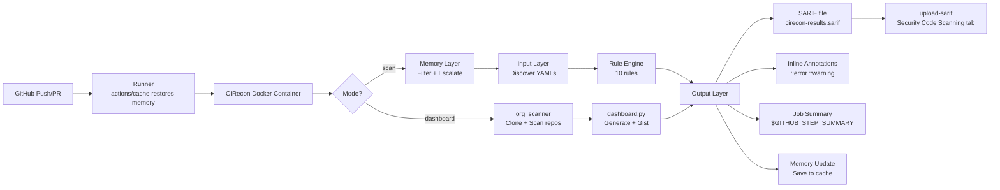
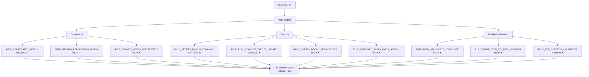
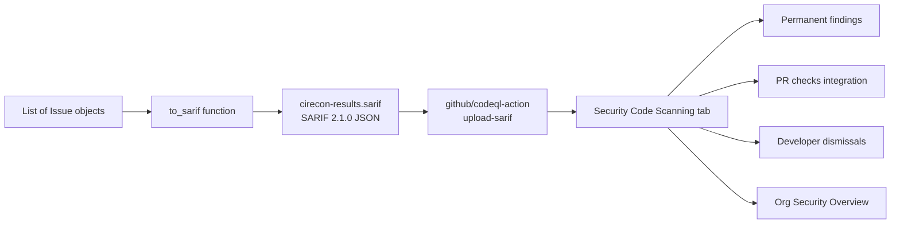
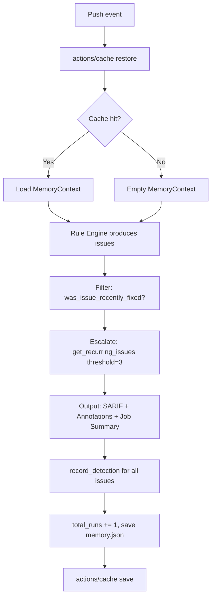
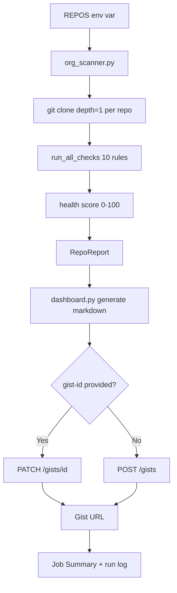

# CIRecon Architecture

> A GitHub Code Scanning provider for CI/CD workflows — static analysis engine, SARIF output, per-repo adaptive memory, and org-wide health monitoring.

---

## Table of Contents

1. [System Overview](#1-system-overview)
2. [High-Level Architecture](#2-high-level-architecture)
3. [Architecture Layers](#3-architecture-layers)
4. [Memory Layer](#4-memory-layer)
5. [Dashboard Mode](#5-dashboard-mode)
6. [End-to-End Data Flow](#6-end-to-end-data-flow)
7. [Technology Stack](#7-technology-stack)
8. [Design Decisions and Tradeoffs](#8-design-decisions-and-tradeoffs)
9. [Security](#9-security)
10. [Known Limitations](#10-known-limitations)
11. [Future Roadmap](#11-future-roadmap)
12. [Mermaid Diagrams](#12-mermaid-diagrams)

---

## 1. System Overview

### What CIRecon Is

CIRecon is an open-source GitHub Action that scans `.github/workflows/*.yml` files using a 10-rule static analysis engine covering correctness, security, and runtime behavioral gaps. It outputs findings in three formats: SARIF (for GitHub Code Scanning integration), inline annotations (for exact file and line highlighting in the GitHub UI), and a structured Job Summary (for every Actions run page). CIRecon maintains per-repo adaptive memory via GitHub Actions cache — remembering what it has already flagged so it stops repeating itself and escalates recurring issues. An org-wide dashboard mode scans multiple repositories and publishes a health score report to a GitHub Gist.

### The Problem It Solves

GitHub Actions workflow files fail in ways that are hard to diagnose. A deprecated action version produces cryptic errors. A secret accidentally printed to logs exposes credentials. A `pull_request` workflow that works locally silently fails on fork PRs. Most existing linters only check syntax and schema — they miss security misconfigurations and runtime behavioral gaps, and they produce the same output every run including issues the developer already knows about.

CIRecon solves the detection problem by covering three categories of issues other tools miss. It solves the noise problem with adaptive memory. It solves the visibility problem by integrating with GitHub's Security → Code Scanning tab — the same place CodeQL and Dependabot findings appear.

### Intended Users

- Developers maintaining GitHub Actions workflows
- Security-conscious teams wanting automated CI/CD hygiene
- Platform teams wanting org-wide visibility into CI/CD health
- Open-source maintainers managing multiple repositories

### High-Level Execution Lifecycle

**Scan mode:**

1. Push or PR event modifies `.github/workflows/`
2. Runner restores `.cirecon-memory/` from Actions cache
3. CIRecon Docker container starts
4. Memory loaded — recent issues filtered, recurring issues escalated
5. All workflow files discovered and parsed
6. 10-rule engine runs against every file
7. Inline annotations printed to stdout
8. Job Summary written to `$GITHUB_STEP_SUMMARY`
9. SARIF file written to `cirecon-results.sarif`
10. Memory updated and saved back to cache
11. `github/codeql-action/upload-sarif` uploads findings to Code Scanning

**Dashboard mode:**

1. Scheduled or manual trigger
2. Each repo cloned (shallow, depth=1)
3. All 10 rules run per repo
4. Health scores computed
5. Dashboard published to GitHub Gist
6. Dashboard written to Job Summary

### Architectural Principles

- **Static analysis only.** CIRecon reads and reports. It never writes files, creates branches, or opens PRs.
- **SARIF as primary integration.** Findings in GitHub's Code Scanning tab are permanent, dismissable, and tracked across PRs — more valuable than transient log output.
- **Adaptive output.** Memory makes the tool quieter about known issues and louder about recurring ones.
- **Zero infrastructure.** No servers, no databases, no external services beyond GitHub itself.

### Non-Goals

- CIRecon does not auto-fix or commit changes to workflow files
- CIRecon does not review application code
- CIRecon does not support GitLab CI or CircleCI in v1

---

## 2. High-Level Architecture

```
┌─────────────────────────────────────────────────────────────────┐
│                     GitHub Repository                           │
│  Push / PR Event → .github/workflows/*.yml modified             │
└───────────────────────────┬─────────────────────────────────────┘
                            │ triggers
                            ▼
┌─────────────────────────────────────────────────────────────────┐
│                    GitHub Actions Runner                        │
│  actions/cache restores .cirecon-memory/                        │
│  Docker container spun up                                       │
└───────────────────────────┬─────────────────────────────────────┘
                            │
                            ▼
┌─────────────────────────────────────────────────────────────────┐
│                 Mode Router (main.py)                           │
│  MODE=scan → run()   |   MODE=dashboard → run_dashboard()       │
└────────────┬──────────────────────────┬────────────────────────┘
             │ scan                      │ dashboard
             ▼                           ▼
┌────────────────────┐     ┌────────────────────────────────────┐
│   Memory Layer     │     │   org_scanner.py                   │
│   Load + Filter    │     │   Clone repos, run 10 rules        │
│   + Escalate       │     │   Compute health scores            │
└────────┬───────────┘     └──────────────┬─────────────────────┘
         │                                │
         ▼                                ▼
┌────────────────────┐     ┌────────────────────────────────────┐
│   Input Layer      │     │   dashboard.py                     │
│   Discover YAMLs   │     │   Generate markdown                │
└────────┬───────────┘     │   Publish to GitHub Gist           │
         │                 └──────────────┬─────────────────────┘
         ▼                                │
┌────────────────────┐                   │
│   Rule Engine      │                   │
│   10 rules         │                   │
└────────┬───────────┘                   │
         │                               │
         ▼                               ▼
┌─────────────────────────────────────────────────────────────────┐
│                      Output Layer                               │
│  SARIF file → cirecon-results.sarif                             │
│  Inline annotations → stdout (::error / ::warning)              │
│  Job Summary → $GITHUB_STEP_SUMMARY                             │
│  Memory update → saved back to cache                            │
│  Gist → dashboard mode only                                     │
└─────────────────────────────────────────────────────────────────┘
                            │
                            ▼
┌─────────────────────────────────────────────────────────────────┐
│  github/codeql-action/upload-sarif                              │
│  Security → Code Scanning tab                                   │
│  Permanent findings, history, dismissals, PR checks             │
└─────────────────────────────────────────────────────────────────┘
```

---

## 3. Architecture Layers

### Trigger Layer

Docker container action. `action.yml` defines inputs and passes them as environment variables.

**Inputs:**

```yaml
inputs:
  mode:             default: 'scan'
  repos:            required: false
  gist-id:          required: false
  fail-on-unresolved: default: 'false'
  github-token:     required: false  # dashboard mode only
```

**Required workflow permissions for full feature set:**

```yaml
permissions:
  security-events: write   # SARIF upload
```

---

### Input Layer

Discovers all `.github/workflows/*.yml` and `.yaml` files using `pathlib.Path.glob()`. Each file is read as a raw string and parsed with PyYAML. The GitHub Actions JSON schema is fetched from SchemaStore once per run and cached in memory.

---

### Rule Engine

Ten independent rule functions. Each returns `list[Issue]`.

**Issue schema:**

```python
@dataclass
class Issue:
    id: str
    severity: Severity        # LOW | MEDIUM | HIGH | CRITICAL
    message: str
    location: Location        # file, line, column
    auto_fixable: bool
    confidence: float
    suggested_fix: Optional[str]
```

**Line number tracking:** Every rule uses `find_line(content, search_str)` to locate the exact line, enabling precise SARIF regions and inline annotations.

**All rules:**

| Rule ID | Category | Severity | Auto-fixable |
|---|---|---|---|
| `RULE_DEPRECATED_ACTION` | Correctness | MEDIUM | ✅ |
| `RULE_MISSING_PERMISSIONS_BLOCK` | Correctness | HIGH | ✅ |
| `RULE_BROKEN_NEEDS_DEPENDENCY` | Correctness | HIGH | ❌ |
| `RULE_SECRET_IN_RUN_COMMAND` | Security | CRITICAL | ❌ |
| `RULE_PULL_REQUEST_TARGET_UNSAFE` | Security | CRITICAL | ❌ |
| `RULE_OVERLY_BROAD_PERMISSIONS` | Security | HIGH | ❌ |
| `RULE_UNPINNED_THIRD_PARTY_ACTION` | Security | HIGH | ❌ |
| `RULE_FORK_PR_SECRET_EXPOSURE` | Runtime behavioral | HIGH | ❌ |
| `RULE_WRITE_STEP_ON_FORK_TRIGGER` | Runtime behavioral | HIGH | ❌ |
| `RULE_REF_CONDITION_MISMATCH` | Runtime behavioral | MEDIUM | ❌ |

---

### SARIF Output Layer

CIRecon converts its `list[Issue]` to SARIF 2.1.0 format:

```python
def to_sarif(issues: list[Issue], repo: str = "") -> dict:
    return {
        "$schema": "https://json.schemastore.org/sarif-2.1.0.json",
        "version": "2.1.0",
        "runs": [{
            "tool": {
                "driver": {
                    "name": "CIRecon",
                    "version": "1.0.0",
                    "rules": [/* one entry per unique rule ID */]
                }
            },
            "results": [
                {
                    "ruleId": issue.id,
                    "level": "error" if severity in ["critical", "high"] else "warning",
                    "message": {"text": issue.message},
                    "locations": [{
                        "physicalLocation": {
                            "artifactLocation": {
                                "uri": issue.location.file,
                                "uriBaseId": "%SRCROOT%"
                            },
                            "region": {"startLine": issue.location.line or 1}
                        }
                    }]
                }
                for issue in issues
            ]
        }]
    }
```

The SARIF file is written to `$GITHUB_WORKSPACE/cirecon-results.sarif` and uploaded by `github/codeql-action/upload-sarif` in the calling workflow. This requires `permissions: security-events: write` and works on public repos or repos with GitHub Advanced Security.

**What SARIF upload provides:**

- Findings appear in Security → Code Scanning permanently
- GitHub tracks new vs existing issues across PRs
- Developers can dismiss false positives with reasons
- PR checks can block merge on new issues
- Org-wide Security Overview integration

---

### Inline Annotations Layer

Printed to stdout using GitHub workflow commands:

```python
for issue in all_issues:
    level = "error" if issue.severity.value in ["critical", "high"] else "warning"
    line = issue.location.line or 1
    print(f"::{level} file={issue.location.file},line={line},title={issue.id}::{issue.message}")
```

Visible on Actions run page, PR diff views, and Files changed tab. Zero permissions required.

---

### Job Summary Layer

Written to `$GITHUB_STEP_SUMMARY`:

```python
with open(os.environ["GITHUB_STEP_SUMMARY"], "a") as f:
    f.write("## CIRecon Report\n\n")
    f.write(f"**Files scanned:** {n} | **Issues found:** {n} | ...\n\n")
    # structured markdown table per issue
```

Zero permissions required. Always visible on the Actions run Summary tab.

---

### Validation Layer

For the two auto-fixable rules, fixes are computed in memory and validated through a 3-stage gate before being reported as validated in the Job Summary:

1. **YAML syntax** — `yaml.safe_load()`
2. **Schema conformance** — `jsonschema.validate()` against GitHub Actions schema
3. **Rule re-check** — `run_all_checks()` confirms no new issues introduced

Nothing is ever written to disk. Fixes are reported with their suggested content for manual application.

---

## 4. Memory Layer

### Overview

Per-repo memory at `.cirecon-memory/memory.json` in the workspace, persisted via GitHub Actions cache. Each repo has completely isolated memory.

### Memory Schema

```python
@dataclass
class FixRecord:
    issue_id: str
    file: str
    fix_applied: str
    detected_at: str

@dataclass
class MemoryContext:
    repo: str
    total_runs: int
    fixes: list[FixRecord]
    rejected_fixes: list[str]
    known_secrets: list[str]
```

### Behaviors

**Skip recently reported issues (reduces noise):**

```python
def was_issue_recently_fixed(memory, issue_id, file, within_runs=5) -> bool:
    recent = memory.fixes[-(within_runs):]
    return any(f.issue_id == issue_id and f.file == file for f in recent)
```

**Escalate recurring issues (increases signal):**

```python
def get_recurring_issues(memory, threshold=3) -> list[str]:
    counts = Counter(f.issue_id for f in memory.fixes)
    return [id for id, count in counts.items() if count >= threshold]
```

MEDIUM → HIGH, HIGH → CRITICAL for recurring issues. Message appended with `[RECURRING — seen 3+ times]`.

### Cache Mechanism

```yaml
- uses: actions/cache@v4
  with:
    path: .cirecon-memory
    key: cirecon-memory-${{ github.repository }}
```

Cache key scoped to repository — complete isolation. Expires after 7 days of inactivity, handled gracefully by reinitialising.

### Why Cache Over Git Commits

GitHub's Contents API blocks writes to `.github/workflows/` — the files CIRecon cares most about. Git subprocess can push to branches but requires a PAT and creates unwanted noise commits. GitHub Actions cache requires no permissions and no commits.

---

## 5. Dashboard Mode

### org_scanner.py

```python
@dataclass
class RepoReport:
    repo: str
    files_scanned: int
    issues: list[Issue]
    health_score: int   # 0–100
    scanned_at: str
```

Health score: start 100, deduct 20/CRITICAL, 10/HIGH, 5/MEDIUM, 2/LOW, minimum 0.

Per repo: `git clone --depth 1` → `discover_workflow_files` → `run_all_checks` → strip tmpdir prefix from paths → calculate score → cleanup.

### dashboard.py

Generates markdown and publishes via `PATCH /gists/{id}` (update) or `POST /gists` (create). Requires classic PAT with `gist` scope — `GITHUB_TOKEN` from Actions cannot create Gists.

---

## 6. End-to-End Data Flow

**Scan mode:**

```
1.  Push event → CIRecon action starts
2.  actions/cache restores .cirecon-memory/
3.  Memory loaded → filter recent + escalate recurring
4.  Input Layer: discover .github/workflows/*.yml
5.  Rule Engine: 10 rules → List[Issue]
6.  Output: ::error/::warning annotations → stdout
7.  Output: Job Summary → $GITHUB_STEP_SUMMARY
8.  Output: SARIF → cirecon-results.sarif
9.  Memory: record detections, increment runs, save
10. actions/cache saves .cirecon-memory/
11. upload-sarif → Security Code Scanning tab
```

**Dashboard mode:**

```
1.  Trigger → CIRecon starts (mode=dashboard)
2.  org_scanner: clone → scan → score per repo
3.  dashboard: generate markdown → PATCH/POST Gist
4.  Output: dashboard → Job Summary
5.  Print Gist URL to log
```

---

## 7. Technology Stack

| Component | Technology | Why |
|---|---|---|
| Language | Python 3.11+ | Standard ecosystem, match clause syntax |
| YAML parsing | `PyYAML` | Fast, standard, sufficient for read-only analysis |
| Schema validation | `jsonschema` | JSON Schema draft-07, used by SchemaStore |
| SARIF output | Standard library `json` | No deps — SARIF is plain JSON |
| GitHub API | `requests` | Raw HTTP for Gist API and secrets check |
| Action packaging | Docker container | Reproducible environment |
| Testing | `pytest` + `unittest.mock` | Industry standard |
| Coverage | `pytest-cov` | Enforced 80% minimum in CI |
| Linting | `ruff` | Fast, modern Python linter |
| Memory | GitHub Actions cache | Zero infrastructure, no permissions |
| Dashboard | GitHub Gist | Zero infrastructure, stable URL |
| Code Scanning | SARIF + `upload-sarif` | GitHub-native security integration |

---

## 8. Design Decisions and Tradeoffs

**SARIF as primary integration target:**

Inline annotations disappear into the Actions log and have no history. Job Summary is visible but ephemeral. SARIF findings in Code Scanning are permanent, tracked across PRs, dismissable by developers, and visible in org-wide Security Overview. This is categorically more useful for a security-focused tool.

**Static analysis only:**

CIRecon reads and reports. Writing files, creating branches, or opening PRs requires fighting GitHub's permission model (Contents API blocks workflow file writes regardless of token). Staying read-only means zero permissions in the default configuration.

**10 focused rules over broad coverage:**

Each rule addresses a documented real-world failure mode. Runtime behavioral rules (`RULE_FORK_PR_SECRET_EXPOSURE`, `RULE_REF_CONDITION_MISMATCH`, `RULE_WRITE_STEP_ON_FORK_TRIGGER`) fill a genuine gap — no existing tool models the behavioral differences between `push` and `pull_request` events.

**Memory via GitHub Actions cache:**

Persistent memory without git commits. Cache is scoped per-repo, requires no permissions, and degrades gracefully on expiry.

**Dashboard via Gist:**

Simplest possible persistent shareable URL. No infrastructure, no Pages setup, works for private repos, stable URL across updates.

---

## 9. Security

**Default configuration requires zero permissions.** Inline annotations and Job Summary need nothing. Only SARIF upload requires `security-events: write`.

**No secrets in output.** CIRecon never logs token values.

**No file writes in scan mode.** Nothing is modified in the scanned repo. Validated fix content is computed in memory and reported only.

**Docker isolation.** Each run executes in a fresh container. No state persists beyond what is explicitly saved to cache.

**Memory isolation.** Cache keys are scoped by full repository name — `cirecon-memory-owner/repo`. Repos cannot access each other's memory.

---

## 10. Known Limitations

**SARIF upload requires Advanced Security for private repos.**

GitHub Code Scanning integration works on all public repos. Private repos require GitHub Advanced Security (paid). Inline annotations and Job Summary work on all repos regardless.

**No auto-fix commits.**

CIRecon validates fixes in memory and reports them, but does not commit. GitHub's Contents API blocks writes to `.github/workflows/` regardless of token permissions.

**Memory expires after 7 days of inactivity.**

GitHub Actions cache has a 7-day expiry. Handled gracefully by reinitialising from scratch.

**Line numbers are approximate for some rules.**

Rules using string search (`find_line`) point to the first matching line. Rules that match patterns spanning multiple locations may not point to the most relevant line.

**Dashboard mode requires a PAT.**

`GITHUB_TOKEN` from Actions cannot create or update Gists. Classic PAT with `gist` scope required.

---

## 11. Future Roadmap

**More rules:**

- `RULE_MISSING_CHECKOUT_STEP`
- `RULE_INVALID_RUNS_ON`
- `RULE_DUPLICATE_JOB_ID`
- DVC and GPU runner checks for ML repos

**SHA pinning auto-fix:**

Resolve current commit SHA via GitHub API for `RULE_UNPINNED_THIRD_PARTY_ACTION`.

**AST-based line tracking:**

Replace string search with proper YAML AST parsing for precise line numbers on all rules.

**Extended platform support:**

GitLab CI, CircleCI, Azure Pipelines.

**Local CLI:**

```
pip install cirecon
cirecon scan .
```

**Dashboard trend tracking:**

Week-over-week health score history per repo in dashboard mode.

---

## 12. Mermaid Diagrams

### Overall Architecture



### Rule Engine — 3 Categories



### SARIF Integration Flow



### Memory Lifecycle



### Dashboard Data Flow



---

*CIRecon is open source under the MIT License. Contributions welcome — see [CONTRIBUTING.md](CONTRIBUTING.md).*
