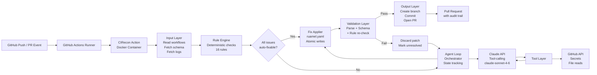
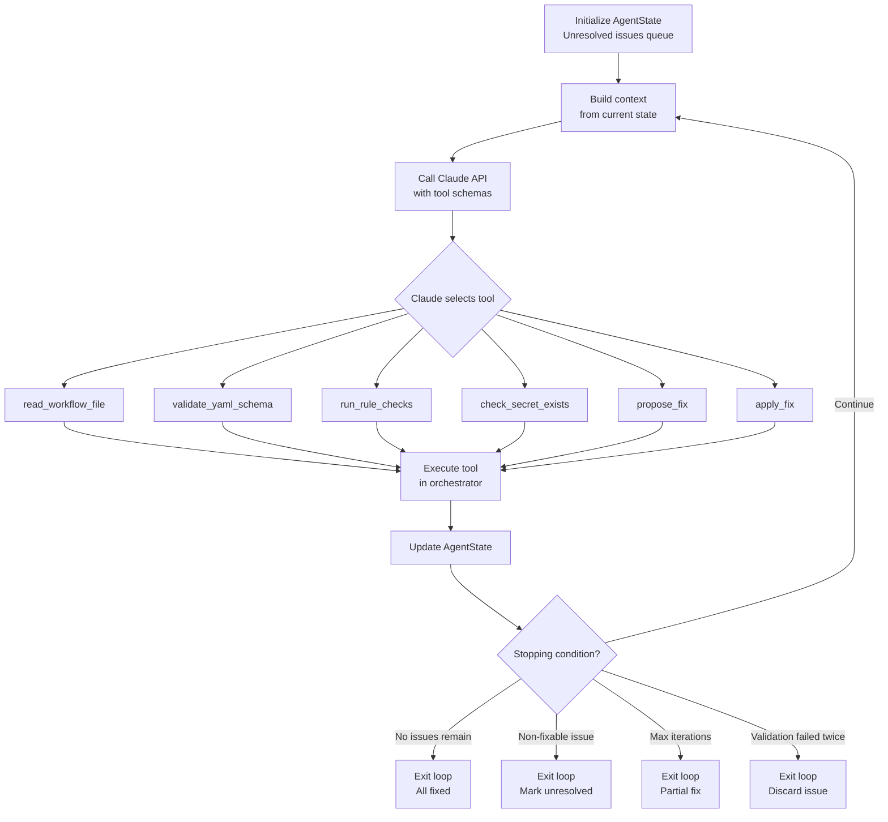
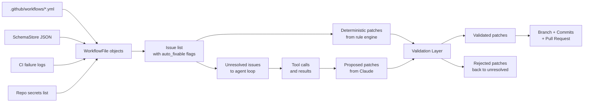
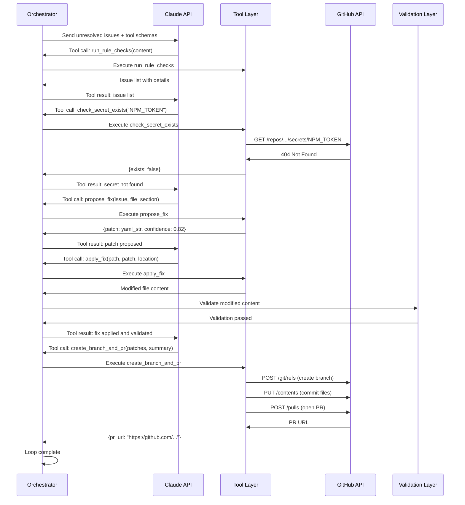

# CIRecon Architecture

> A deterministic-first, agent-assisted GitHub Action for CI/CD workflow repair.

---

## Table of Contents

1. [System Overview](#1-system-overview)
2. [High-Level Architecture](#2-high-level-architecture)
3. [Architecture Layers](#3-architecture-layers)
4. [End-to-End Data Flow](#4-end-to-end-data-flow)
5. [Technology Stack](#5-technology-stack)
6. [Design Decisions and Tradeoffs](#6-design-decisions-and-tradeoffs)
7. [Security](#7-security)
8. [Scalability](#8-scalability)
9. [Known Limitations](#9-known-limitations)
10. [Future Roadmap](#10-future-roadmap)
11. [Mermaid Diagrams](#11-mermaid-diagrams)

---

## 1. System Overview

### What CIRecon Is

CIRecon is an open-source GitHub Action that automatically scans `.github/workflows/*.yml` files in a repository, detects CI/CD configuration errors using a rule-based static analysis engine, and — when deterministic analysis cannot resolve an issue — invokes the Claude API through a structured tool-calling loop to reason about and repair the problem. All validated fixes are committed to a new branch and surfaced as a Pull Request with a structured explanation.

### The Problem It Solves

Broken CI/CD pipelines are disproportionately expensive relative to their root causes. A misindented YAML block, a deprecated action version, a missing `permissions` key, or a `needs:` reference pointing to a renamed job — any of these can silently block an entire team's deployment pipeline. Diagnosing these failures requires reading log output, cross-referencing the GitHub Actions schema, and manually editing YAML files before re-pushing to trigger another run.

CIRecon eliminates this loop. It detects the class of errors that are mechanically fixable, fixes them without human intervention, and brings the remaining issues to the developer's attention in a structured, reviewable format — the Pull Request.

### Intended Users

- Individual developers who maintain repositories with GitHub Actions workflows
- Teams that want automated CI/CD hygiene without a paid third-party SaaS
- Open-source maintainers managing multiple repositories
- MLOps engineers running GPU-intensive or artifact-heavy CI pipelines

### Repository Workflow

CIRecon is installed once in a repository by adding a workflow file that calls the action. It runs on push or pull request events targeting workflow files. It requires no persistent server, no external account, and no dashboard. The only external dependencies are the GitHub API (always present) and, optionally, the Anthropic API (BYO key via GitHub Secrets).

### High-Level Execution Lifecycle

1. A push or PR event modifies a file under `.github/workflows/`
2. GitHub spins up a runner and executes the CIRecon action
3. CIRecon reads all workflow files in the repository
4. The rule engine runs deterministic checks and categorizes every issue by fixability
5. All deterministically fixable issues are patched immediately
6. Any remaining issues are passed to the agent loop, which uses Claude's tool-calling API to reason about repairs iteratively
7. All patches are validated before being committed
8. A new branch is created, fixes are committed, and a PR is opened with a full audit trail

### Major Architectural Principles

- **Deterministic first.** The rule engine always runs. The LLM is never called when a rule already covers the issue.
- **LLM as bounded fallback.** The agent loop is constrained by a maximum iteration count, a validation gate, and explicit stopping conditions. It cannot run unboundedly.
- **BYO key.** CIRecon does not manage API keys. Each user provides their own Anthropic API key as a GitHub Secret.
- **No commits without validation.** Every patch is re-parsed and re-validated against the GitHub Actions schema before being written to disk.
- **Human approval required.** CIRecon opens a PR. It never merges automatically.

### Design Goals

- Zero running cost for the project maintainer
- Useful in rule-engine-only mode with no API key
- Transparent: every fix is explained in the PR description
- Safe: validation gate prevents committing broken YAML
- Extensible: new rules can be added as Python functions without modifying the agent loop

### Non-Goals

- CIRecon does not review application code (use CodeRabbit or similar for that)
- CIRecon does not merge PRs
- CIRecon does not manage secrets or create them
- CIRecon does not guarantee semantic correctness of complex business logic in workflows
- CIRecon does not support GitLab CI or CircleCI in v1 (see roadmap)

---

## 2. High-Level Architecture

CIRecon is structured as a layered pipeline. Each layer has a single responsibility and a defined interface. Control flows top-to-bottom; data flows between layers through structured Python objects.

```
┌─────────────────────────────────────────────────────────────────┐
│                     GitHub Repository                           │
│  Push / PR Event → .github/workflows/*.yml modified             │
└───────────────────────────┬─────────────────────────────────────┘
                            │ triggers
                            ▼
┌─────────────────────────────────────────────────────────────────┐
│                    GitHub Actions Runner                        │
│  Docker container spun up, action.yml entry point executed      │
└───────────────────────────┬─────────────────────────────────────┘
                            │
                            ▼
┌─────────────────────────────────────────────────────────────────┐
│                       Input Layer                               │
│  Reads workflow files, CI logs, repo metadata, schema           │
└───────────────────────────┬─────────────────────────────────────┘
                            │ normalized WorkflowFile objects
                            ▼
┌─────────────────────────────────────────────────────────────────┐
│                      Rule Engine                                │
│  16+ deterministic checks → structured Issue list               │
│  auto_fixable: true → immediate patch                           │
│  auto_fixable: false → passed to agent loop                     │
└────────────┬──────────────────────────┬────────────────────────┘
             │ all fixed                │ unresolved issues remain
             ▼                          ▼
┌────────────────────┐     ┌────────────────────────────────────┐
│  Fix Applier       │     │          Agent Loop                │
│  (deterministic)   │     │  Orchestrator + Claude API         │
└────────┬───────────┘     │  Tool-calling, state tracking      │
         │                 │  Max iterations, stopping cond.    │
         │                 └──────────────┬─────────────────────┘
         │                                │ proposed patches
         │                                ▼
         │                 ┌────────────────────────────────────┐
         │                 │         Tool Layer                  │
         │                 │  read_workflow_file                 │
         │                 │  validate_yaml_schema               │
         │                 │  run_rule_checks                    │
         │                 │  check_secret_exists                │
         │                 │  propose_fix                        │
         │                 │  apply_fix                          │
         │                 │  create_branch_and_pr               │
         │                 └──────────────┬─────────────────────┘
         │                                │
         └──────────────┬─────────────────┘
                        │ all patches collected
                        ▼
┌─────────────────────────────────────────────────────────────────┐
│                    Validation Layer                             │
│  Re-parse + re-validate every patched file                      │
│  Reject patches that introduce new errors                       │
└───────────────────────┬─────────────────────────────────────────┘
                        │ validated patches only
                        ▼
┌─────────────────────────────────────────────────────────────────┐
│                    Output Layer                                 │
│  Create branch → commit files → open PR with structured body    │
└─────────────────────────────────────────────────────────────────┘
```

---

## 3. Architecture Layers

### Trigger Layer

**Purpose:** Initialize the action, load configuration, and pass environment context into the pipeline.

**Responsibilities:**
- Define the action's interface via `action.yml`
- Accept user-configured inputs
- Load secrets from the environment
- Set up the Docker container runtime

**action.yml inputs:**

```yaml
inputs:
  anthropic-api-key:
    description: 'Anthropic API key (optional, enables LLM fallback)'
    required: false
  auto-fix:
    description: 'Whether to open a PR with fixes'
    required: false
    default: 'true'
  max-iterations:
    description: 'Maximum agent loop iterations'
    required: false
    default: '10'
  fail-on-unresolved:
    description: 'Fail the workflow if issues remain after repair'
    required: false
    default: 'false'
  severity-threshold:
    description: 'Minimum severity to report: low | medium | high | critical'
    required: false
    default: 'medium'
```

**Why Docker container action over composite action:**
A Docker container action guarantees a fixed, reproducible Python environment with all dependencies pinned. A composite action inherits the runner's environment, which can vary between GitHub-hosted runners and self-hosted runners, causing subtle dependency conflicts. For a tool that parses and modifies YAML files and calls external APIs, reproducibility is not optional.

**Permissions required:**

```yaml
permissions:
  contents: write      # create branch, commit files
  pull-requests: write # open PR
  actions: read        # read workflow run logs
  secrets: read        # check secret existence
```

---

### Input Layer

**Purpose:** Gather all data the rule engine and agent loop need before any analysis begins.

**Responsibilities:**
- Discover all workflow files in `.github/workflows/`
- Parse each file into a normalized internal representation
- Fetch the GitHub Actions JSON schema from SchemaStore
- Retrieve CI failure logs from the triggering workflow run (if available)
- Collect repository metadata (name, default branch, existing secrets list)

**Workflow discovery:**

```python
@dataclass
class WorkflowFile:
    path: str
    raw_content: str
    parsed: dict          # PyYAML parse result
    ruamel_parsed: Any    # ruamel.yaml parse result (preserves formatting)
    schema: dict          # GitHub Actions JSON schema
    ci_log: Optional[str] # failure log from the triggering run, if available
```

The schema is fetched from:
```
https://json.schemastore.org/github-workflow.json
```

It is cached locally for the duration of the run. It is never embedded in the repository because it changes as GitHub ships new Actions features.

**Failure handling:** If a workflow file cannot be parsed by PyYAML at all (malformed YAML), it is flagged immediately with a `YAML_SYNTAX_ERROR` issue and excluded from further analysis until that error is resolved.

---

### Rule Engine (Deterministic Layer)

**Purpose:** Identify every detectable issue in a workflow file through static analysis, without any LLM involvement.

**Why deterministic analysis precedes LLM reasoning:**
LLM calls cost tokens and take time. The majority of CI/CD errors — deprecated action versions, missing `permissions` blocks, broken `needs:` references — are structurally detectable and structurally fixable with zero ambiguity. Calling an LLM to fix `actions/checkout@v2 → actions/checkout@v4` is wasteful. The rule engine handles these immediately, cheaply, and with 100% confidence. The LLM is only invoked for issues where static analysis cannot produce a confident fix.

**Issue schema:**

```python
@dataclass
class Issue:
    id: str                    # e.g. "RULE_DEPRECATED_ACTION"
    severity: Literal["low", "medium", "high", "critical"]
    message: str               # human-readable description
    location: Location         # file, line, column
    auto_fixable: bool         # true = rule engine fixes it
    confidence: float          # 0.0–1.0
    suggested_fix: Optional[str]  # patch string if auto_fixable
```

**Rules:**

| Rule ID | Description | Auto-fixable |
|---|---|---|
| `YAML_SYNTAX_ERROR` | File cannot be parsed as valid YAML | No |
| `SCHEMA_VALIDATION_ERROR` | File does not conform to GitHub Actions schema | Partial |
| `DEPRECATED_ACTION_VERSION` | Action pinned to a deprecated or outdated version (e.g. `@v2`) | Yes |
| `INVALID_TRIGGER_SYNTAX` | `on:` block uses invalid event names or malformed syntax | Yes |
| `MISSING_PERMISSIONS_BLOCK` | Workflow or job has no `permissions:` block | Yes |
| `INVALID_RUNS_ON` | `runs-on` value is not a recognized runner label | No |
| `BROKEN_NEEDS_DEPENDENCY` | A `needs:` entry references a job ID that does not exist | Yes |
| `MISSING_USES_OR_RUN` | A step has neither `uses` nor `run` defined | No |
| `DUPLICATE_JOB_ID` | Two jobs share the same ID | No |
| `UNDEFINED_REUSABLE_WORKFLOW` | A `uses:` at job level references a non-existent workflow path | No |
| `INVALID_MATRIX_SYNTAX` | `strategy.matrix` is malformed or references undefined keys | Partial |
| `UNDEFINED_OUTPUT` | A job references an output not declared by the producing job | No |
| `SECRET_NOT_FOUND` | A `${{ secrets.X }}` reference names a secret that does not exist in the repo | No |
| `UNSUPPORTED_EXPRESSION` | An expression uses syntax not supported by GitHub Actions | No |
| `MISSING_CHECKOUT_STEP` | A job that operates on repository files has no `actions/checkout` step | Yes |
| `INVALID_REUSABLE_ACTION_REF` | A `uses:` step references a local action path that does not exist | No |

**Parsing pipeline:**

```
raw YAML string
    → PyYAML safe_load()            # structural parse, fast
    → jsonschema.validate()         # schema conformance
    → ruamel.yaml.load()            # comment-preserving parse for fix application
    → rule functions (parallel)     # each rule is an independent function
    → Issue list
```

---

### Agent Loop

**Purpose:** Resolve issues that the rule engine cannot fix deterministically by reasoning about them iteratively using Claude's tool-calling API.

**Why an explicit orchestration loop instead of a single LLM call:**
A single LLM call with a list of issues and a request to "fix all of them" is unreliable for several reasons: the model may produce a patch that fixes one issue and introduces another; there is no mechanism to validate intermediate results; and the context window becomes unmanageable for large workflow files with many issues. An explicit loop with a validation gate after each tool execution gives CIRecon the ability to detect and reject bad patches before they accumulate.

**State object:**

```python
@dataclass
class AgentState:
    scanned_files: List[str]
    issues_found: List[Issue]
    issues_fixed: List[Issue]
    unresolved: List[Issue]
    iteration: int
    tool_history: List[ToolCall]
    patches: List[Patch]
    validation_results: List[ValidationResult]
```

**Orchestrator loop (pseudocode):**

```python
while state.unresolved and state.iteration < max_iterations:
    context = build_context(state)
    response = claude.messages.create(
        model="claude-sonnet-4-6",
        tools=TOOL_DEFINITIONS,
        messages=context
    )
    tool_call = parse_tool_call(response)
    result = execute_tool(tool_call)
    state = update_state(state, tool_call, result)
    if validation_failed(result):
        state.unresolved.append(tool_call.target_issue)
        continue
    state.issues_fixed.append(tool_call.target_issue)
    state.iteration += 1
```

**Stopping conditions:**
- `state.unresolved` is empty
- An issue is returned with `fixable: false` by the agent's `propose_fix` tool
- The same issue fails validation twice in a row (repeated failure)
- `state.iteration >= max_iterations`
- Claude API returns a non-retryable error

---

### Tool Layer

Each tool is a Python function with a defined interface exposed to Claude via the tool-calling schema. Claude does not execute tools — it requests them by name with arguments. The orchestrator executes the function and returns the result to Claude in the next message.

---

#### `read_workflow_file`

**Purpose:** Read a workflow file from disk and return its content.

**Interface:**
```python
def read_workflow_file(path: str) -> ToolResult:
    ...
```

**Returns:**
```python
ToolResult(
    success=True,
    data={"path": path, "content": raw_str, "line_count": n}
)
```

**Failure cases:** File not found, permission denied. Returns `success=False` with error message.

---

#### `validate_yaml_schema`

**Purpose:** Validate a YAML string against the GitHub Actions workflow schema.

**Interface:**
```python
def validate_yaml_schema(content: str) -> ToolResult:
    ...
```

Fetches schema from local cache (loaded at startup from SchemaStore). Returns list of `jsonschema.ValidationError` objects serialized as dicts.

---

#### `run_rule_checks`

**Purpose:** Run the full deterministic rule engine against a YAML string and return the issue list.

**Interface:**
```python
def run_rule_checks(content: str, path: str) -> ToolResult:
    ...
```

Returns list of `Issue` objects. This allows the agent to re-check a file after applying a patch.

---

#### `check_secret_exists`

**Purpose:** Verify whether a named secret is configured in the repository.

**Interface:**
```python
def check_secret_exists(secret_name: str) -> ToolResult:
    ...
```

Calls the GitHub REST API:
```
GET /repos/{owner}/{repo}/actions/secrets/{secret_name}
```

Returns `{"exists": True/False}`. Note: the API confirms existence but never returns the secret value.

**Retry behavior:** 1 retry on 5xx. No retry on 404 (secret does not exist).

---

#### `propose_fix`

**Purpose:** Ask Claude to draft a YAML patch for a specific issue. This is the only tool where Claude generates free-form content. All other tools are deterministic.

**Interface:**
```python
def propose_fix(issue: Issue, file_content: str) -> ToolResult:
    ...
```

Claude is prompted with:
- The issue's `id`, `message`, and `location`
- The relevant section of the workflow file (not the entire file, to minimize tokens)
- A constraint to return only the patched YAML block, no explanation

Returns:
```python
ToolResult(
    success=True,
    data={"patch": yaml_str, "confidence": 0.85, "explanation": str}
)
```

---

#### `apply_fix`

**Purpose:** Apply a patch to a workflow file and return the modified content.

**Interface:**
```python
def apply_fix(path: str, patch: str, location: Location) -> ToolResult:
    ...
```

Uses `ruamel.yaml` to apply the patch while preserving comments and formatting. Does not write to disk — returns the modified content string. The orchestrator passes this to the validation layer before any write occurs.

---

#### `create_branch_and_pr`

**Purpose:** Create a branch, commit all validated patches, and open a Pull Request.

**Interface:**
```python
def create_branch_and_pr(
    patches: List[Patch],
    issues_fixed: List[Issue],
    unresolved: List[Issue]
) -> ToolResult:
    ...
```

Calls:
- `POST /repos/{owner}/{repo}/git/refs` — create branch
- `PUT /repos/{owner}/{repo}/contents/{path}` — commit each file
- `POST /repos/{owner}/{repo}/pulls` — open PR

The PR body is generated from a structured template (see Output Layer).

---

### GitHub Integration Layer

CIRecon interacts with the GitHub REST API using `PyGithub` for most operations and raw `requests` calls for endpoints not covered by PyGithub (e.g. the Actions secrets existence check).

Authentication uses the `GITHUB_TOKEN` provided automatically by GitHub Actions — no personal access token is required for same-repository operations.

GraphQL is not used in v1. The REST API covers all required operations, and REST responses are simpler to handle in a tool-calling context where the agent reads return values.

---

### Claude Integration

**Why Claude is optional:**
The rule engine covers the majority of real-world CI/CD issues. A meaningful portion of repositories will get full value from CIRecon with no API key configured. Making Claude optional means CIRecon is deployable anywhere, including security-sensitive environments where external API calls are not permitted.

**Tool-calling workflow:**
CIRecon uses the Anthropic tool-calling API (`tools` parameter in `messages.create`). Claude is given the tool schemas at the start of the loop and selects tools based on the current issue and state. The orchestrator never passes tool results back in a way that allows Claude to "see" secret values — only existence confirmations.

**Context window management:**
- Workflow files are truncated to the relevant section around the issue location (±50 lines)
- Tool history is summarized after 5 iterations rather than passed in full
- The full workflow file is never passed to `propose_fix`; only the relevant block is

**Token optimization:**
- Haiku-class models are used for classification tasks (is this issue fixable?)
- Sonnet-class models are used for `propose_fix` only
- The model is specified per tool call, not globally

**Retry policy:**
- 3 retries with exponential backoff on 429 (rate limit) and 5xx errors
- No retry on 400 (bad request) — surface to orchestrator immediately

**Cost optimization:**
Because the rule engine handles all deterministic fixes for free, Claude is only called when the remaining issue list is non-empty after rule engine execution. In a well-maintained repository, CIRecon may run Claude zero times per execution.

---

### Fix Applier

**Why `ruamel.yaml` instead of `PyYAML`:**

PyYAML's `yaml.dump()` re-serializes the entire document from its internal representation. This destroys:
- Inline comments (`# deploy only on main`)
- Blank lines used for visual grouping
- Anchor/alias formatting
- Key ordering in mappings

`ruamel.yaml` is a round-trip YAML parser — it preserves the original document structure and only modifies the nodes that were explicitly changed. This is non-negotiable for a tool that modifies other people's configuration files. A fix that removes all comments from a carefully maintained workflow file is not a fix.

**Atomic writes:**
Modified content is written to a temporary file first. If the write succeeds, the original file is replaced via `os.replace()` (atomic on POSIX). If any step fails, the original file is untouched.

**Rollback:**
The original file content is stored in memory before any patch is applied. If the validation layer rejects the patched file, the original content is restored from memory. No git operations are performed until all patches have passed validation.

---

### Validation Layer

After every patch — whether from the rule engine or the agent loop — the following checks run in sequence:

1. `ruamel.yaml.load()` — confirms the patched file is syntactically valid YAML
2. `jsonschema.validate()` — confirms conformance to the GitHub Actions schema
3. `run_rule_checks()` — confirms no new issues were introduced by the patch

A patch is committed only if all three checks pass. If any check fails, the patch is discarded, the issue is moved back to `unresolved`, and the agent loop is informed (if active).

This prevents a class of failure where the agent proposes a fix that resolves the target issue but introduces a different schema violation.

---

### Output Layer

**Branch naming:**
```
ci-recon/fix-{YYYYMMDD-HHMMSS}
```

**PR title:**
```
[CIRecon] Auto-fix {n} CI/CD workflow issue(s)
```

**PR body structure:**

```markdown
## CIRecon Report

**Files scanned:** 3
**Issues found:** 5
**Issues auto-fixed:** 4
**Requires human attention:** 1

---

## Fixed Issues

| File | Line | Issue | Fix Applied | Confidence |
|------|------|-------|-------------|------------|
| deploy.yml | 12 | DEPRECATED_ACTION_VERSION | Bumped actions/checkout@v2 → @v4 | 100% |
| test.yml | 34 | MISSING_PERMISSIONS_BLOCK | Added read-only permissions block | 100% |

---

## Unresolved Issues

| File | Line | Issue | Reason |
|------|------|-------|--------|
| release.yml | 7 | SECRET_NOT_FOUND | Secret `NPM_TOKEN` is not configured in this repository |

---

## Validation Status

All applied fixes passed YAML syntax validation, schema validation, and rule-engine re-check.

---

*Generated by [CIRecon](https://github.com/arpita-rathwa/CIRecon)*
```

---

### Fallback / Graceful Degradation

| Failure Condition | Behavior |
|---|---|
| No `ANTHROPIC_API_KEY` configured | Rule engine runs; agent loop skipped; PR opened with deterministic fixes only |
| Claude API unavailable (5xx after retries) | Log warning; skip agent loop; proceed with rule engine fixes; unresolved issues reported in PR |
| GitHub API failure on PR creation | Write patched files to disk and log the diff; exit non-zero if `fail-on-unresolved: true` |
| Patch fails validation | Discard patch; restore original file; mark issue as unresolved |
| Max iterations reached | Commit validated patches collected so far; open PR with partial fixes; remaining issues listed |
| Repeated validation failure on same issue | Mark issue as `non-fixable`; move to unresolved; do not retry |

---

## 4. End-to-End Data Flow

**Control flow** is shown with `→`. **Data flow** is shown with `⇒`.

```
1.  GitHub push event (workflow file modified)
        → GitHub triggers CIRecon action

2.  Docker container starts
        → action.yml entry point: python -m cirecon.main
        ⇒ inputs loaded: api key, max_iterations, auto_fix, severity_threshold

3.  Input Layer executes
        → reads all .github/workflows/*.yml
        → fetches GitHub Actions schema from SchemaStore (or local cache)
        → retrieves CI failure log from triggering run (if available)
        → fetches list of configured secrets from GitHub API
        ⇒ List[WorkflowFile] produced

4.  Rule Engine executes against each WorkflowFile
        → 16 rule functions run in parallel per file
        ⇒ List[Issue] produced, each with auto_fixable flag

5.  Decision point A: are there any auto_fixable issues?
        YES → Fix Applier applies deterministic patches
              → Validation Layer checks each patch
              → valid patches accumulated
        NO  → proceed

6.  Decision point B: are there unresolved issues AND is an API key present?
        YES → Agent Loop initializes AgentState
              → Orchestrator builds context from unresolved issues
              → Claude API called with tool schemas
              → Claude selects a tool and provides arguments
              → Orchestrator executes the tool
              → Result returned to Claude
              → Claude selects next tool or signals completion
              → Validation Layer checks each proposed patch
              → Loop continues until stopping condition
        NO  → proceed to output

7.  Output Layer executes
        → All validated patches written to files
        → Branch created via GitHub API
        → Files committed to branch
        → PR opened with structured report body

8.  Action exits
        → exit 0 if auto_fix succeeded or no issues found
        → exit 1 if fail-on-unresolved: true and issues remain
```

---

## 5. Technology Stack

| Component | Technology | Why |
|---|---|---|
| Language | Python 3.11+ | Match clause syntax for tool dispatch; standard ML/DevOps ecosystem |
| LLM SDK | `anthropic` Python SDK | Native tool-calling support; streaming; typed responses |
| YAML parsing (analysis) | `PyYAML` | Fast, standard; sufficient for read-only parsing |
| YAML parsing (fix application) | `ruamel.yaml` | Round-trip parsing preserves comments, ordering, formatting |
| Schema validation | `jsonschema` | Official JSON Schema draft-07 support; used by SchemaStore |
| GitHub API client | `PyGithub` | Typed wrapper around REST API; handles auth and pagination |
| Action packaging | Docker container action | Reproducible environment; no runner dependency |
| Testing | `pytest` + `pytest-mock` | Industry standard; easy fixture-based YAML testing |
| CI for CIRecon itself | GitHub Actions | Dogfoods its own tooling |
| Workflow schema | SchemaStore `github-workflow.json` | Authoritative, community-maintained, regularly updated |
| Console output | `rich` | Structured log output in GitHub Actions runner logs |
| Data validation | `pydantic` | Type-safe state objects and tool return schemas |

---

## 6. Design Decisions and Tradeoffs

**Rule engine before LLM:**
The rule engine is free, fast, deterministic, and testable. Running the LLM first would burn tokens on problems that static analysis already handles perfectly. The rule engine also produces structured `Issue` objects that give the agent loop precise, grounded context when it does run.

**LLM only as fallback:**
Not all CI/CD issues require language model reasoning. Most require pattern matching. Defaulting to the LLM for everything would make CIRecon expensive to run and dependent on a paid API for basic functionality. The BYO key model requires that rule-engine-only mode be genuinely useful.

**BYO API key:**
CIRecon has zero operating cost by design. The BYO key model means CIRecon can scale to any number of users without infrastructure. It also keeps the security model simple: API keys never leave the user's GitHub Secrets.

**Docker container action vs composite action:**
Composite actions inherit the runner environment. Python version, pip, and system library differences across runners have caused subtle failures in other Python-based actions. Docker eliminates this class of problem entirely. The startup overhead (~10–15 seconds for image pull) is acceptable given that CI/CD debugging typically costs much more time.

**`ruamel.yaml` vs `PyYAML` for fixes:**
PyYAML is used for analysis because it is faster and its output does not matter (we discard it). `ruamel.yaml` is used for fix application because its output is what gets committed. Preserving the user's comments and formatting is a UX requirement, not a preference.

**REST API vs GraphQL:**
GraphQL would reduce round trips for some operations (e.g. fetching file content + metadata in one query). However, GraphQL responses are harder to handle in a tool-calling context where Claude reads the return value. The predictability and simplicity of REST responses outweigh the efficiency gain in v1.

**Tool-calling vs single-prompt repair:**
A single prompt asking the model to fix all issues at once produces unverified output. Tool-calling forces the model to take one action at a time, which allows the orchestrator to validate each step, reject bad patches, and update state incrementally. This is more reliable at the cost of more API calls.

**Iterative loop vs one-shot:**
One-shot is faster and cheaper but cannot recover from a bad patch. The iterative loop with a validation gate after each step means a failed fix does not corrupt the workflow file. The max iteration cap prevents runaway costs.

**Deterministic validation before commit:**
A patch that introduces a schema violation is worse than no patch. The validation gate is a hard requirement, not a nice-to-have. It is the only mechanism that prevents CIRecon from making a user's CI/CD situation worse.

---

## 7. Security

**Least privilege permissions:**
CIRecon requests only the permissions it needs: `contents: write` (to commit fixes), `pull-requests: write` (to open PRs), `actions: read` (to read failure logs), `secrets: read` (to check secret existence). It does not request `admin` or `org` level permissions.

**GitHub Secrets:**
The Anthropic API key is stored as a GitHub Secret and passed to the action as an environment variable. It is never logged, never embedded in the PR body, and never passed to Claude as part of a prompt.

**API key isolation:**
The API key is read once at startup and used only for Anthropic API calls. It is not stored in any file, not included in error messages, and not accessible to tool functions except `propose_fix`, which uses the pre-initialized SDK client, not the raw key string.

**Prompt injection considerations:**
Workflow YAML files could theoretically contain content designed to manipulate the agent's behavior (e.g. a comment saying "ignore all previous instructions"). CIRecon mitigates this by passing only structured, parsed fields to Claude — the issue's `id`, `severity`, and `location` — not arbitrary user-authored strings. Free-form YAML content is passed only to `propose_fix`, where the model is constrained to output only a YAML block.

**Branch isolation:**
All fixes are committed to a new branch. The main/default branch is never touched directly. This ensures that a bad fix cannot break the repository's primary branch before a human reviews it.

**No source code retention:**
CIRecon does not send application code to any external service. Only workflow YAML files (and only the relevant sections) are sent to the Claude API.

**Immutable audit trail:**
Every fix is recorded in the PR body with the issue ID, the rule or tool that generated it, the confidence score, and the diff. This audit trail cannot be modified after the PR is opened.

---

## 8. Scalability

**Large repositories:**
CIRecon processes only `.github/workflows/*.yml` files, not the entire repository. Even large monorepos typically have fewer than 20 workflow files. Processing time scales with the number and complexity of workflow files, not repository size.

**Multiple workflow files:**
Rule engine checks run in parallel across files using Python's `concurrent.futures.ThreadPoolExecutor`. The agent loop processes issues sequentially (by design — each fix may affect subsequent checks).

**Incremental scanning:**
When triggered by a PR event, CIRecon can optionally scan only the workflow files changed in the PR rather than all workflow files. This is controlled by the `scan-changed-only` input.

**Caching:**
The GitHub Actions JSON schema is fetched once per run and cached in memory. Future versions may cache it to disk between runs using GitHub Actions cache.

**Rate limiting:**
GitHub API calls are wrapped with retry logic and backoff. CIRecon respects the `X-RateLimit-Remaining` header and pauses if approaching the limit. Claude API calls use exponential backoff on 429 responses.

**Claude token limits:**
Workflow files are rarely large enough to approach Claude's context window limits. The truncation strategy (±50 lines around the issue location) ensures that even pathologically large workflow files do not cause context overflow.

**Performance expectations:**
- Rule engine only (no API key): ~2–5 seconds for a typical repository
- Rule engine + agent loop: ~15–60 seconds depending on number of unresolved issues and Claude API latency

---

## 9. Known Limitations

**Cannot infer business logic:**
CIRecon validates structural and syntactic correctness. It cannot determine whether a workflow does the right thing for a given business process. A structurally valid workflow that deploys to the wrong environment is out of scope.

**Cannot repair broken third-party actions:**
If an action referenced in `uses:` has been deleted from the GitHub Marketplace or its repository, CIRecon can detect the reference but cannot propose a valid replacement without knowing the user's intent.

**Cannot create missing secrets:**
When a `${{ secrets.X }}` reference is detected and the secret does not exist, CIRecon flags it and explains what needs to be created. It cannot create GitHub Secrets on the user's behalf — this requires credentials that CIRecon should never possess.

**Cannot guarantee semantic correctness:**
A patch that passes YAML syntax validation, schema validation, and rule-engine re-check may still not produce the intended CI/CD behavior. CIRecon validates structure, not semantics.

**Human approval always required before merge:**
CIRecon opens a PR. It does not merge. Every fix requires a human to review the diff and approve the merge. This is a deliberate design constraint, not a limitation to be removed.

**Agent loop is not deterministic:**
The rule engine produces the same output for the same input, always. The agent loop does not. Two runs on the same unresolved issue may produce different patches. This is an inherent property of LLM-based systems.

**Context window limits affect complex files:**
Workflow files with deeply nested structures, many jobs, and long inline scripts may cause the relevant section extraction heuristic to miss important context for `propose_fix`.

---

## 10. Future Roadmap

**ML pipeline validation (v2):**
- DVC pipeline YAML checks (`dvc.yaml`, `params.yaml` references)
- GPU runner validation (checking that GPU-dependent steps use `runs-on: [self-hosted, gpu]` or equivalent)
- Model artifact caching checks (ensuring `actions/cache` is configured for model weights)
- Dataset download step ordering validation

**Extended platform support (v3):**
- GitLab CI (`.gitlab-ci.yml`) — different schema, same architectural approach
- CircleCI (`.circleci/config.yml`)
- Azure Pipelines (`azure-pipelines.yml`)
- Bitbucket Pipelines

**Kubernetes and deployment workflow checks:**
- `kubectl apply` step validation
- Helm chart reference checks
- Environment variable propagation checks for Kubernetes secrets

**Local CLI mode:**
A `cirecon` CLI that runs the same analysis locally before push, without requiring a GitHub Actions runner.

**VS Code extension:**
Real-time workflow YAML linting using the CIRecon rule engine as a language server, surfacing issues as underlines in the editor.

**Self-learning repair suggestions:**
Aggregate anonymized (opt-in) fix patterns across repositories to improve rule confidence scores over time.

**Web dashboard:**
A read-only dashboard showing CIRecon run history, fix rates, and common issue patterns across an organization's repositories.

---

## 11. Mermaid Diagrams

### Overall Architecture



---

### Agent Loop



---

### Data Flow



---

### Tool Invocation Sequence



---

*CIRecon is open source under the MIT License. Contributions welcome — see [CONTRIBUTING.md](CONTRIBUTING.md).*
